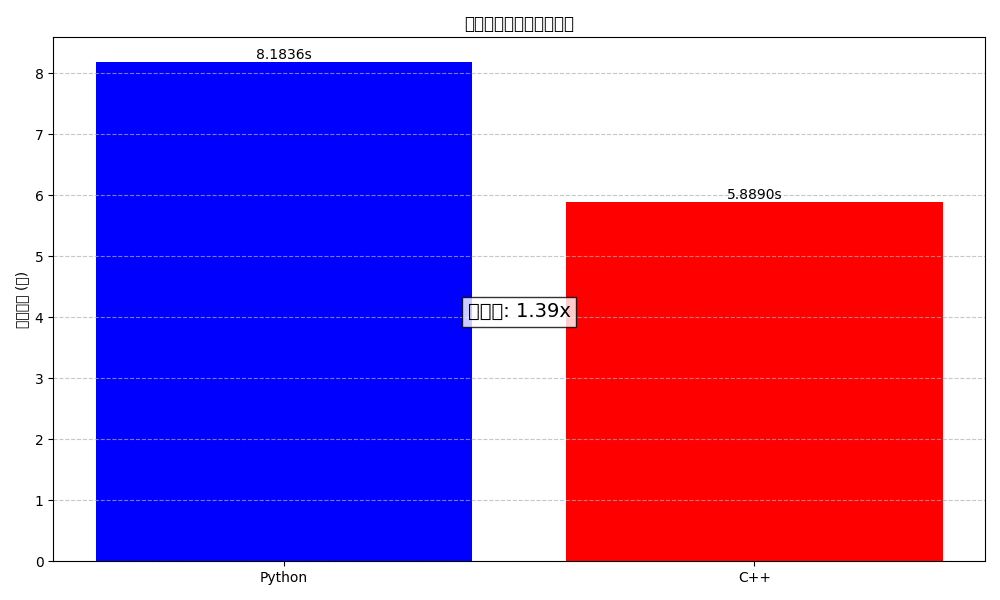

# CFD项目C++库文档

本文档提供CFD项目中所有C++库的概述和详细说明。这些高性能库专为处理大型网格模型而设计，显著提升了关键几何操作的计算速度。

## 库概览

| 库名称 | 功能描述 | 性能提升 | 源文件 |
|--------|---------|----------|--------|
| free_edges_cpp | 检测模型中的自由边 | 比Python快1.39倍 | [`free_edges_detector.cpp`](src/free_edges_detector.cpp) |
| mesh_reader | 读取多种格式的网格文件 | - | [`mesh_reader.cpp`](src/mesh_reader.cpp), [`mesh_reader.hpp`](src/mesh_reader.hpp) |

## 系统要求

- C++14兼容的编译器
  - GCC 5.0+
  - MSVC 2017+
  - Clang 3.4+
- Python 3.7+ (用于Python绑定)
- pybind11 (用于Python绑定)
- Eigen 3.3+ (用于矩阵运算)

## 构建说明

每个库都可以独立构建。详细构建指南请参阅各库的专门文档:

- [free_edges_cpp构建指南](docs/free_edges_cpp.md)
- [mesh_reader构建指南](docs/mesh_reader.md)

## 性能对比

### free_edges_cpp

我们使用包含1,200,000个面片的复杂3D门格海绵分形模型测试性能:

| 实现 | 执行时间(秒) | 相对速度 |
|------|-------------|---------|
| Python | 8.18 | 1.00x |
| C++ | 5.89 | 1.39x |

### mesh_reader

读取性能对比待添加。

## 许可证

这些库使用MIT许可证，详见 [LICENSE](LICENSE) 文件。

## 贡献指南

我们欢迎贡献！如果您想改进这些库，请:

1. Fork仓库
2. 创建您的功能分支 (`git checkout -b feature/amazing-feature`)
3. 提交您的更改 (`git commit -m 'Add some amazing feature'`)
4. 推送到分支 (`git push origin feature/amazing-feature`)
5. 创建一个Pull Request

## 联系方式

如有问题或建议，请通过项目Issues页面联系我们。 