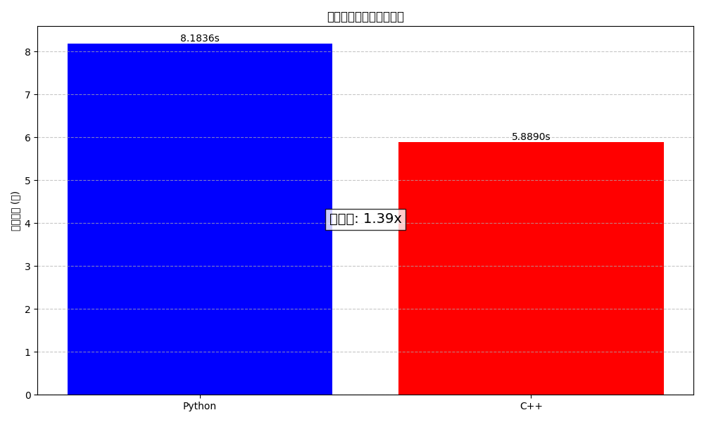

# free_edges_cpp：高性能自由边检测库

`free_edges_cpp`是一个高性能C++库，用于快速检测复杂网格模型中的自由边。相比于Python实现，本库提供了显著的性能提升，特别适合处理大型模型。

## 功能概述

- 高效检测三角形网格中的自由边（仅与一个面相连的边）
- 提供C++原生API和Python绑定
- 包含性能计时功能，方便性能对比
- 针对大型模型（>100万面片）优化

## API参考

### C++ API

```cpp
// 自由边检测函数
std::vector<std::pair<int, int>> detect_free_edges_cpp(
    const std::vector<std::vector<int>>& faces);

// 带计时功能的自由边检测函数
std::pair<std::vector<std::pair<int, int>>, double> detect_free_edges_with_timing(
    const std::vector<std::vector<int>>& faces);
```

### Python API

```python
# 从C++模块导入
import free_edges_cpp

# 检测自由边
free_edges = free_edges_cpp.detect_free_edges(faces)

# 检测自由边并返回执行时间
free_edges, execution_time = free_edges_cpp.detect_free_edges_with_timing(faces)
```

## 技术实现

`free_edges_cpp`使用高效的哈希映射来统计每条边的出现次数：

1. 为每个面的三条边创建边记录（较小顶点索引在前）
2. 使用自定义哈希函数将边作为键存储在哈希表中，计数作为值
3. 仅出现一次的边被识别为自由边

核心算法实现如下：

```cpp
// 用于记录每条边出现的次数
std::unordered_map<std::pair<int, int>, int, EdgeHash> edge_count;

// 遍历所有面片，收集边信息
for (const auto& face : faces) {
    // 对于三角形面片，处理三条边
    if (face.size() >= 3) {
        // 获取面片的三条边（保证较小的顶点索引在前）
        std::pair<int, int> edge1 = {std::min(face[0], face[1]), std::max(face[0], face[1])};
        std::pair<int, int> edge2 = {std::min(face[1], face[2]), std::max(face[1], face[2])};
        std::pair<int, int> edge3 = {std::min(face[2], face[0]), std::max(face[2], face[0])};
        
        // 更新边的计数
        edge_count[edge1]++;
        edge_count[edge2]++;
        edge_count[edge3]++;
    }
}

// 找出只出现一次的边（自由边）
std::vector<std::pair<int, int>> free_edges;
for (const auto& edge_pair : edge_count) {
    if (edge_pair.second == 1) {
        free_edges.push_back(edge_pair.first);
    }
}
```

## 性能对比

使用包含120万个面片的复杂3D模型进行性能测试的结果：

| 实现 | 执行时间(秒) | 相对速度 |
|------|-------------|---------|
| Python | 8.18 | 1.00x |
| C++ | 5.89 | 1.39x |



## 构建指南

### 依赖项

- C++14兼容的编译器
- Python 3.7+
- pybind11
- setuptools

### 安装步骤

1. 确保已安装所有依赖项
2. 编译库：

```bash
# 安装pybind11（如果尚未安装）
pip install pybind11

# 从源码编译
cd src
python setup.py build_ext --inplace
```

3. 测试库：

```bash
# 运行性能对比测试
python compare_free_edges.py
```

## 集成示例

以下是将库集成到网格查看器的示例：

```python
import free_edges_cpp

class MeshViewerEnhanced:
    def __init__(self, mesh_data):
        self.mesh_data = mesh_data
        self.selected_edges = []
        
    def detect_free_edges(self):
        # 使用C++库检测自由边
        try:
            free_edges, computation_time = free_edges_cpp.detect_free_edges_with_timing(
                self.mesh_data['faces'].tolist()
            )
            print(f"检测到{len(free_edges)}条自由边，用时{computation_time:.4f}秒")
            self.selected_edges = free_edges
        except Exception as e:
            print(f"C++检测失败：{e}，回退到Python实现")
            # 这里可以实现Python版本的回退
```

## 已知限制

- 仅支持三角形面片
- 不支持并行计算（计划在未来版本中添加）
- C++代码使用的是Python兼容的数据结构，性能未达最优

## 未来改进

- 添加OpenMP并行支持
- 优化内存使用，减少复制
- 添加更多几何分析功能（边长分析、角度分析等）
- 支持更多网格类型（四边形、多边形等） 